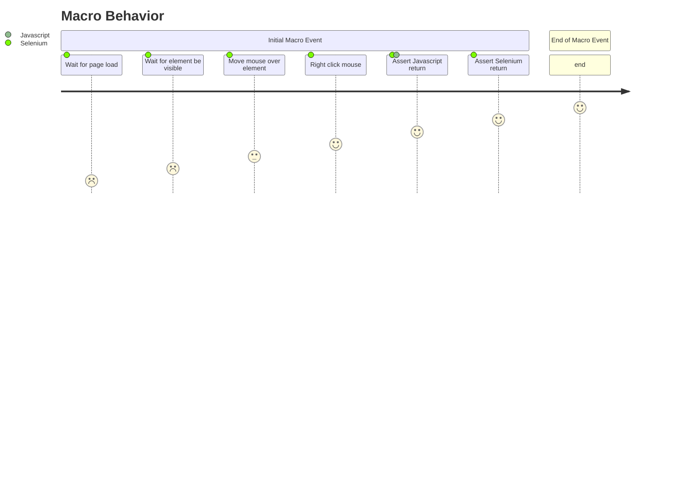

# ClickAt

A component called Click and their respective actions

- `Click` → `Click.clickAt()`

## How to use?
```
Click.clickAt(locator1 = "//a[contains(@id,'BatchPlannerPlanTemplate')][contains(text(),'Download')]");
```

## Click Information

Definition of `clickAt(locator1)`:

```clickAt(locator1)
Arguments

locator         <WebElement><str>

This action will search for a specific Element, move the mouse over to the component
and perform a mouse click on a web element at a specific location on the element.

The method takes two parameters: 
1 - locator of the web element
2 - the x,y coordinate of the point on the element where you want to perform the click.


See the Locating elements section for details about the locator syntax. 
When using the default locator strategy, buttons are searched using:
id    |   class   |   name    |   value     |   xpath
```

## Step By Step
```
    function clickAt {
        # Step 1 - Wait For Page Loads
		WaitForSPARefresh();

        # Step 2 - Wait for element be visible
		selenium.waitForVisible();

        # Step 3 - Move`s the mouse over the specific element
		selenium.mouseOver();

        # Step 4 - Perform a right click mouse event on X,Y Coordinates
		selenium.clickAt(${locator1}, ${value1});

        # Step 5 - Assert any message return for Selenium
		selenium.assertJavaScriptErrors();

        # Step 6 - Assert any message return for Liferay
		selenium.assertLiferayErrors();
	}
```



types of element is now available at [https://liferay.com.br/webElements](http://localhost:3000/my-react-page).

Similar functions is also available at our repository: [https://liferay.com.br/webElements](http://localhost:3000/my-react-page).
