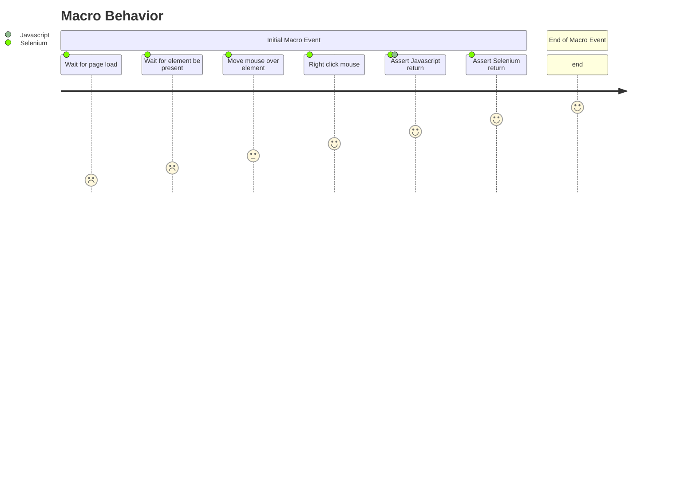

# ClickAtNotVisible

A component called Click and their respective actions

- `Click` → `Click.ClickAtNotVisible()`

## How to use?
```
clickAtNotVisible("//button[@id='myButton']");
```
```
clickAtNotVisible("//button[@id='myButton']", 5000);

```

## Click Information

Definition of `ClickAtNotVisible()`:

```click()
Arguments

locator         <WebElement><str>
time            <Time in milliseconds>

This action will search for a specific Element, then will perform a click on an element on a web page that is not currently visible.

See the Locating elements section for details about the locator syntax. 
When using the default locator strategy, buttons are searched using:
id    |   class   |   name    |   value     |   xpath
```

## Step By Step
```
    function clickAtNotVisible {
        # Step 1 - Wait For Page Loads
		WaitForSPARefresh();

        # Step 2 - Wait for element be present on screen
		selenium.waitForElementPresent();

        # Step 3 - Move`s the mouse over the specific element
		selenium.mouseOver();

        # Step 4 - Perform a right click mouse event
		selenium.clickAt();

        # Step 5 - Assert any message return for Selenium
		selenium.assertJavaScriptErrors();

        # Step 6 - Assert any message return for Liferay
		selenium.assertLiferayErrors();
	}
```


types of element is now available at [https://liferay.com.br/webElements](http://localhost:3000/my-react-page).

Similar functions is also available at our repository: [https://liferay.com.br/webElements](http://localhost:3000/my-react-page).

