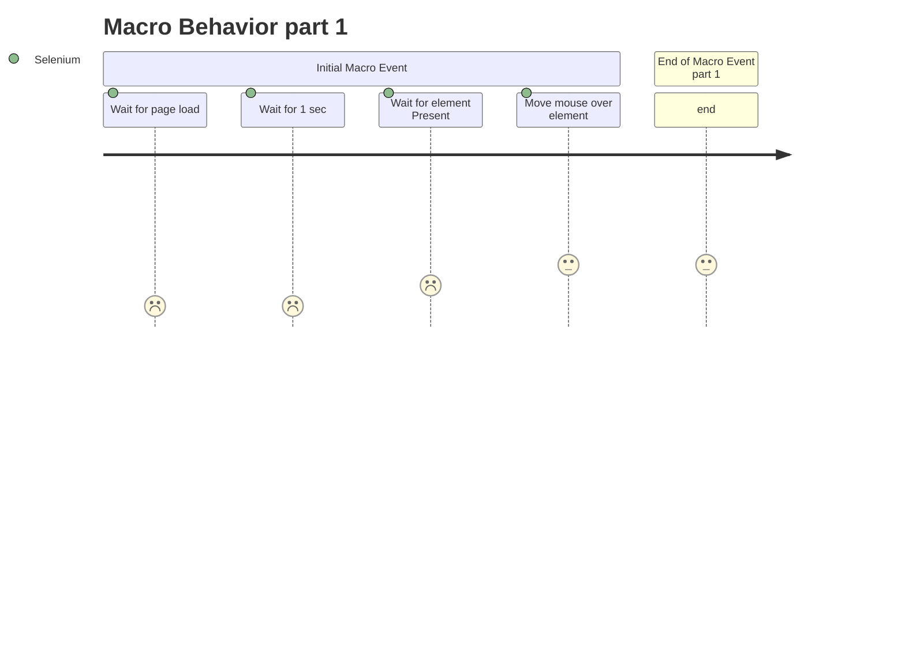
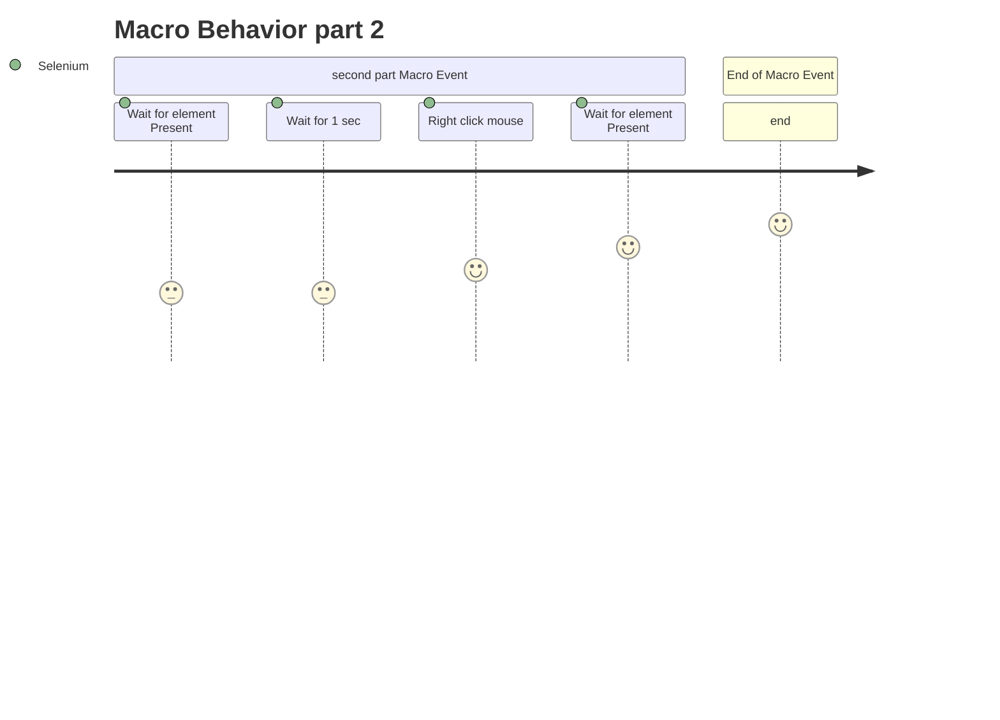

# clickAtSidebarClickAtWaitForScript

A component called Click and their respective actions

- `Click` → `Click.clickAtSidebarClickAtWaitForScript()`

## Click Information

Definition of `clickAtSidebarClickAtWaitForScript()`:

```clickAtSidebarClickAtWaitForScript()
Arguments

locator         <WebElement><str>

This action will search for a visible Element, move the mouse over to the component, wait for another visible element and perform a right click mouse event. the Clicks target is identified by locator.

See the Locating elements section for details about the locator syntax. 
When using the default locator strategy, buttons are searched using:
id    |   class   |   name    |   value     |   xpath
```

## Step By Step

```
    function clickAtSidebarClickAtWaitForScript {

        # Step 1 - Wait For Page Loads
		WaitForSPARefresh();        
        
        # Step 2 - Wait for 1 second
        selenium.pause(1000);

        # Step 3 - Wait for an static element be present on screen | ADD button on Control Menu
		selenium.waitForElementPresent("//*[@data-qa-id='controlMenu']//*[@data-qa-id='add']");

        # Step 4 - Move`s the mouse over the previously static element
		selenium.mouseOver();

        # Step 5 - Wait for an static element be present on screen | Control Menu
        selenium.waitForElementPresent("//script[contains(@src,'/liferay/node.js')] | //script[contains(@src,'/js/control_menu.js')]");

        # Step 6 - Wait for 1 second
        selenium.pause(1000);

        # Step 7 - Perform a right click mouse event
		selenium.clickAt();

        $ Step 8 - Wait for an static element be present on screen | Add Application
		selenium.waitForElementPresent("//script[contains(@src,'/liferay/dockbar_add_application.js')] | //script[contains( @src,'/js/product_navigation_control_menu_add_content.js')] | //script[contains(@src,'js/product_navigation_control_menu_add_application.js')]");
	}
```
## Behavior


types of element is now available at [https://liferay.com.br/webElements](http://localhost:3000/my-react-page).

Similar functions is also available at our repository: [https://liferay.com.br/webElements](http://localhost:3000/my-react-page).
