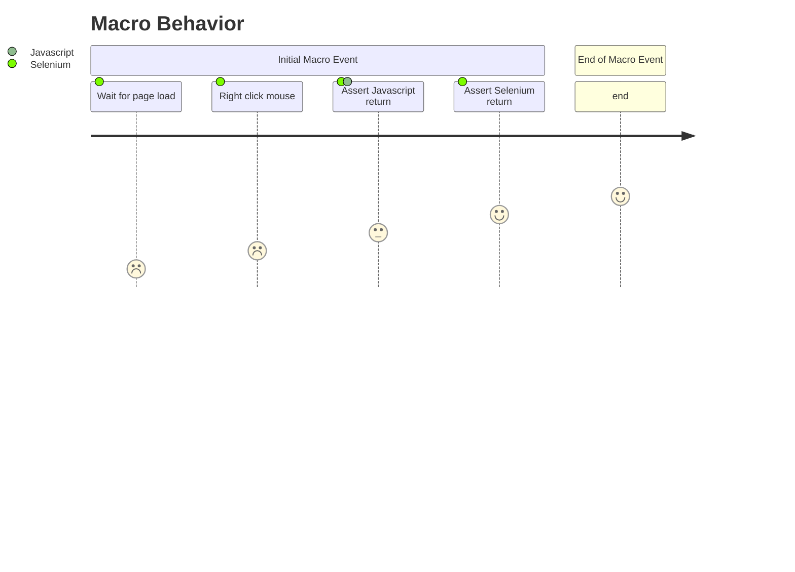

# clickNoMouseOver

A component called Click and their respective actions

- `Click` → `Click.clickNoMouseOver()`

## Click Information

Definition of `clickNoMouseOver()`:

```clickNoMouseOver()
Arguments

locator         <WebElement><str>

This action will perfom a mouse click on a web element without hovering over it first. by locator.

See the Locating elements section for details about the locator syntax. 
When using the default locator strategy, buttons are searched using:
id    |   class   |   name    |   value     |   xpath
```

## Step By Step

```
    function clickNoMouseOver {

        # Step 1 - Wait For Page Loads
		WaitForSPARefresh();

        # Step 2 - Perform a right click mouse event
		selenium.click();

        # Step 3 - Assert any message return for Selenium
		selenium.assertJavaScriptErrors();

        # Step 4 - Assert any message return for Liferay
		selenium.assertLiferayErrors();
	}
```
## Behavior


types of element is now available at [https://liferay.com.br/webElements](http://localhost:3000/my-react-page).

Similar functions is also available at our repository: [https://liferay.com.br/webElements](http://localhost:3000/my-react-page).
