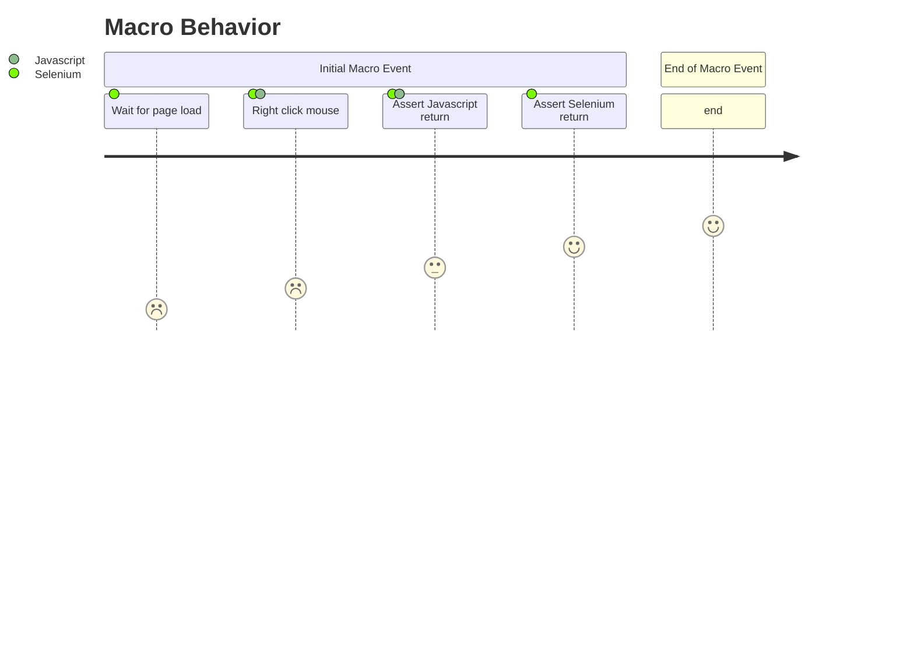

# javaScriptClick

A component called Click and their respective actions

- `Click` → `Click.javaScriptClick()`

## javaScriptClick Information

Definition of `javaScriptClick()`:

```javaScriptClick()
Arguments

locator         <WebElement><str>

This action will search for a specific Element, move the mouse over to the component
and perform a right click mouse event. the Clicks target is identified by locator.

See the Locating elements section for details about the locator syntax. 
When using the default locator strategy, buttons are searched using:
id    |   class   |   name    |   value     |   xpath
```


## Step By Step
```
    function javaScriptClick {
        # Step 1 - Wait For Page Loads
		WaitForSPARefresh();

        # Step 2 - Perform a javascript event to right click mouse event
		selenium.javaScriptClick();

        # Step 3 - Assert any message return for Selenium
		selenium.assertJavaScriptErrors();

        # Step 4 - Assert any message return for Liferay
		selenium.assertLiferayErrors(); 
	}
```

## Behavior


types of element is now available at [https://liferay.com.br/webElements](http://localhost:3000/my-react-page).

Similar functions is also available at our repository: [https://liferay.com.br/webElements](http://localhost:3000/my-react-page).
